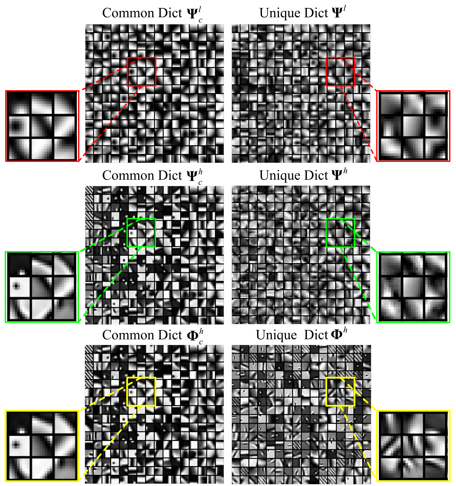
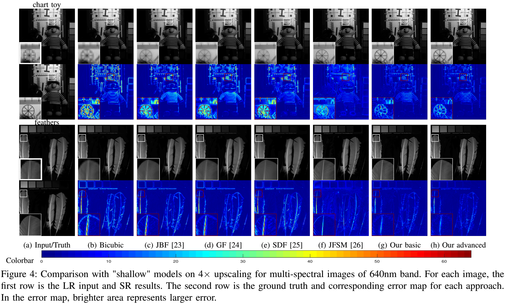

Multimodal Image Super-resolution via Joint Sparse Representations induced by Coupled Dictionaries
========================================================================

This paper proposes a new approach to construct a high-resolution (HR) version of a low-resolution (LR) image given another HR image modality as guidance, based on joint sparse representations induced by coupled dictionaries. Specifically, we proposed a sparse data model to capture the dependency between different image modalities in a learned sparse feature domain. Then, we developed a coupled dictionary learning algorithm that learns the coupled dictionaries from different data modalities, as well as a coupled super-resolution algorithm that enhances the resolution of the target LR image. Further, we introduced an advanced multi-stage version of our approach to improve the model capacity, as well as integrated neighbourhood regression into our framework to take better advantage of a large amount of training samples.

Figure 1: Proposed multimodal image super-resolution approach encompasses a training stage and a testing stage. **X** (or **x**) and **Y** (or **y**) represent the target and guidance image modalities, respectively.

Figure 2: Proposed multi-stage multi-modal image super-resolution approach with optional neighbourhood regression. **X** (or **x**) and **Y** (or **y**) represent the target and guidance modalities, respectively.

The codes are to learn a group of dictionaries or sub-dictionaries which are then used to perform guided image super-resolution for a certain modality, e.g. near-infrared images, with another different modality, e.g. RGB images for guidance. The codes are freely available for research and study purposes.

Please cite:
------------
P. Song, X. Deng, J. F. C. Mota, N. Deligiannis, P. Dragotti and M. Rodrigues, "Multimodal Image Super-resolution via Joint Sparse Representations induced by Coupled Dictionaries," in IEEE Transactions on Computational Imaging. 
doi: 10.1109/TCI.2019.2916502
URL: http://ieeexplore.ieee.org/stamp/stamp.jsp?tp=&arnumber=8715417&isnumber=6960042

P. Song, J. F. Mota, N. Deligiannis, and M. R. Rodrigues, "Coupled dictionary learning for multimodal image super-resolution", in IEEE Global Conf. Signal Inform. Process. IEEE, 2016, pp. 162–166.

Codes written & compiled by:
----------------------------
Pingfan Song
Electronic and Electrical Engineering,
University College London
uceeong@ucl.ac.uk

Packages and codes included and/or adapted:
-------------------------------------------
* OMPBox v9+ and KSVDBox v12+ by Ron Rubinstein, SPAMSv2.5 by Julien Mairal.

* Training and testing datasets are from Columbia multispectral/RGB database:
http://www.cs.columbia.edu/CAVE/databases/multispectral/
and EPFL RGB-NIR Scene database:
http://ivrl.epfl.ch/supplementary_material/cvpr11/

Usage
-----
Folder 'CDLSR_NIR...' is for super-resolution of near-infrared images with RGB images as guidance.

Folder 'CDLSR_MS...' is for super-resolution of multispectral images with RGB images as guidance.

Folder 'data' contains training and testing images.

Please refer to ReadMe.md in each folder for detailed instruction.

Some Results
-------

Figure 3: Learned coupled dictionaries for multi-spectral images of wavelength 640nm and RGB images using the basic version of our algorithm. 256 atoms are shown here. The first row indicates the common and unique dictionaries learned from 4*×* downsampling LR multi-spectral images. The second row indicates the HR dictionary pair. The last row shows the dictionaries learned from guidance RGB modality.  

Figure 4: Comparison with "shallow" models on 4*×* upscaling for multi-spectral images of 640nm band. For each image, the first row is the LR input and SR results. The second row is the ground truth and corresponding error map for each approach. In the error map, brighter area represents larger error.  

Figure 5: Comparison with "shallow" models on 4*×* upscaling for near-infrared house images. For each image, the first row is the LR input and SR results. The second row is the ground truth and corresponding error map for each approach. In the error map, brighter area represents larger error.  

